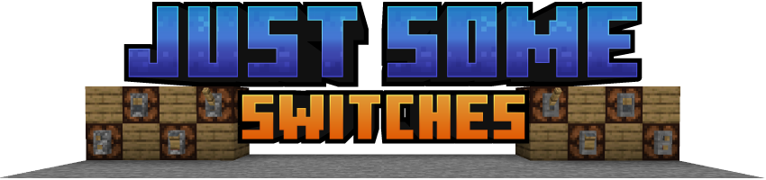
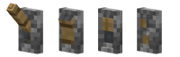
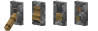
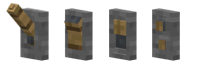
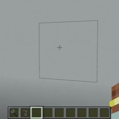
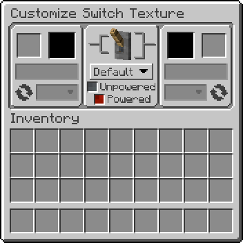

**Just Some Switches** adds 4 new switch models to Minecraft that function just like the vanilla redstone lever, in two tiers: Basic (fixed appearance) and Switches (fully customizable textures). Unpowered and powered indicators are built into the model - no particles.

---

### New Model Styles

- **Lever** — Classic light switch/lever style
- **Rocker** — Rocker switch style
- **Slide** — Slide switch style with indicator blending modes
- **Buttons** — Two button switch style (toggles on/off like a lever, does not auto-depress like a vanilla button)

### Basic Blocks

- Includes normal and inverted variants of each style
  - Normal

  

  - Inverted

  

### Switches Blocks

- Can be placed in any orientation on a block face (wall, ceiling, or floor) with a ghost preview showing placement before confirming

  
- All switch types support waterlogging
- Use the Switches Wrench to open the Texture Customization GUI

### Texture Customization GUI

- Place almost any solid block into the Base or Toggle texture slot
- Dropdown menu under each texture slot allows the choice of which face of the inserted block to use
- Dropdown menu next to the round arrow graphic changes the rotation of the texture
- Power indicator dropdown menu under the 3d preview allows the choice of which texture shows when powered/unpowered (Default, Alt, or None)
- Real-time texture and 3D preview (note that textures with an tint/overlay may not render correctly in the previews)
- 95%+ vanilla block compatibility + compatibility with many modded solid blocks (including blocks with tinting and overlays)

### Switches Wrench

| Action | Keys | Target |
|--------|------|--------|
| Open Texture GUI | Shift + Right-Click | On a Switches block |
| Copy settings | Shift + Alt + C + Right-Click | On a Switches block |
| Paste settings | Shift + Alt + Right-Click | On a Switches block |
| Clear settings | Shift + Right-Click | In the air |
| Instant-break | Left-Click | On any of the mod's blocks |

### Crafting

- **Basic blocks** are crafted from a vanilla lever + stick
- **Switches blocks** are crafted from a basic switch + dye + terracotta + stick + stone
- Normal and inverted variants convert freely via shapeless crafting
- All recipes are browsable in JEI

---

### Block Filtering (for Modpack Creators)

The mod automatically accepts most solid, full-cube blocks as texture sources. For finer control, two block tags let you override this:

- **`justsomeswitches:switches_allowed`** — Blocks in this tag bypass all checks and are always accepted
- **`justsomeswitches:switches_blocked`** — Blocks in this tag are always rejected (takes priority over allowed)

To customize, create a datapack with the tag file at:
`data/justsomeswitches/tags/blocks/switches_allowed.json` or `switches_blocked.json`

Tag references from other mods must use `"required": false` to avoid errors if that mod isn't installed.

### Config Options

**Client** (`justsomeswitches-client.toml`)
- `showSwitchesPreview` — Show ghost preview during placement (default: `true`)

**Common** (`justsomeswitches-common.toml`)
- `tightHitboxesBasic` — Use tight-fitting hitboxes for Basic switch blocks (default: `false`)
- `tightHitboxesSwitches` — Use tight-fitting hitboxes for Switches blocks (default: `true`)

**Server** (`justsomeswitches-server.toml`)
- `allowBlockEntities` — Allow blocks with BlockEntities as texture sources (default: `false`) — may cause crashes with certain modded blocks
- `disableWrenchInstantBreak` — Disable wrench instant breaking (default: `false`) — useful for multiplayer servers

---

### CurseForge

- For downloads and more info, check out the project on [CurseForge](https://www.curseforge.com/minecraft/mc-mods/just-some-switches).

---

### FAQ

**What blocks work as texture sources?**
- Almost any solid, full-cube block — including glazed terracotta, waxed copper, and animated textures.

**Can I use this mod in my modpack?**
- Yes, this mod is MIT licensed. Feel free to include it.

---

**Requires:** Minecraft 1.20.4 · NeoForge 20.4.248+ · Java 17+

**License:** [MIT](https://github.com/theJERMwarfare/JustSomeSwitches/blob/1.20.4/LICENSE)
