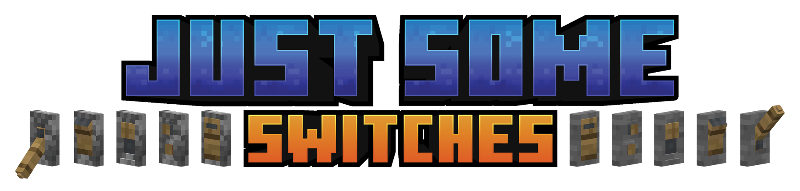
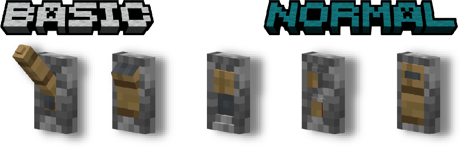
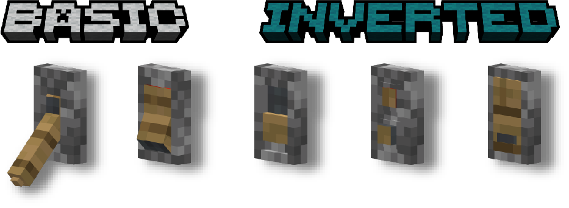
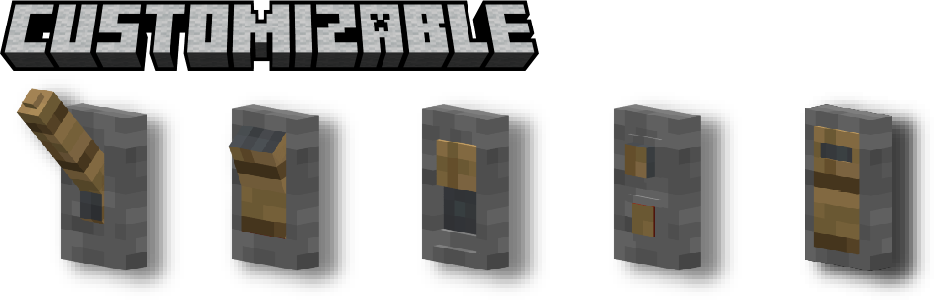
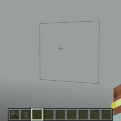
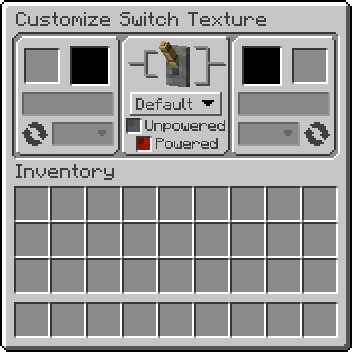

**Just Some Switches** adds 5 new switch models to Minecraft that function just like the vanilla redstone lever, in two tiers: Basic (fixed appearance) and Customizable (fully customizable textures). Unpowered and powered indicators are built into the model - no particles.

---

### New Model Styles

- **Lever** - Classic light switch/lever style
- **Rocker** - Rocker switch style
- **Slide** - Slide switch style with indicator blending modes
- **Button** - Two button switch style (toggles on/off like a lever, does not auto-depress like a vanilla button)
- **Touch** - Touch-pad style with no moving parts (powered state indicated by indicator texture change only)

### Basic Blocks

- Includes normal and inverted variants of each style

  

  

### Customizable Blocks

- Can be placed in any orientation on a block face (wall, ceiling, or floor) with a ghost preview showing placement before confirming

  
- All switch types support waterlogging
- Use the Switch Texture Brush to open the Texture Customization GUI

### Texture Customization GUI

- Place almost any solid block into the Base or Toggle texture slot
- Dropdown menu under each texture slot allows the choice of which face of the inserted block to use
- Dropdown menu next to the round arrow graphic changes the rotation of the texture
- Power indicator dropdown menu under the 3d preview allows the choice of which texture shows when powered/unpowered (Default, Alt, or None)
- Real-time texture and 3D preview (note that textures with an tint/overlay may not render correctly in the previews)
- 95%+ vanilla block compatibility + compatibility with many modded solid blocks (including blocks with tinting and overlays)

### Switch Texture Brush

The Switch Texture Brush displays a distinctive active/loaded texture whenever texture settings have been copied to it, giving a clear visual indication of when settings are ready to paste.

| Action | Keys | Target |
|--------|------|--------|
| Open Texture GUI | Shift + Right-Click | On a Customizable Switch block |
| Copy settings | Shift + Alt + C + Right-Click | On a Customizable Switch block |
| Paste settings | Shift + Alt + Right-Click | On a Customizable Switch block |
| Clear settings | Shift + Right-Click | In the air |
| Instant-break | Left-Click | On any of the mod's blocks |

### Crafting

- **Basic Switch blocks** are crafted from a vanilla lever + a specific material per style
- **Customizable Switch blocks** are crafted from a Basic Switch + dye + terracotta + stick + stone
- Normal and inverted Basic variants convert freely via shapeless crafting
- **Switch Texture Brush** is crafted from a feather + iron ingot + wooden rod (diagonal pattern)
- All recipes are browsable in JEI

---

### Block Filtering (for Modpack Creators)

The mod automatically accepts most solid, full-cube blocks as texture sources. For finer control, two block tags let you override this:

- **`justsomeswitches:switches_allowed`** - Blocks in this tag bypass all checks and are always accepted
- **`justsomeswitches:switches_blocked`** - Blocks in this tag are always rejected (takes priority over allowed)

To customize, create a datapack with the tag file at:
`data/justsomeswitches/tags/blocks/switches_allowed.json` or `switches_blocked.json`

Tag references from other mods must use `"required": false` to avoid errors if that mod isn't installed.

### Config Options

**Client** (`justsomeswitches-client.toml`)
- `showSwitchesPreview` - Show ghost preview during placement (default: `true`)

**Common** (`justsomeswitches-common.toml`)
- `tightHitboxesBasic`  - Use tight-fitting hitboxes for Basic Switch blocks (default: `false`)
- `tightHitboxesSwitches` - Use tight-fitting hitboxes for Customizable Switch blocks (default: `true`)

**Server** (`justsomeswitches-server.toml`)
- `allowBlockEntities` - Allow blocks with BlockEntities as texture sources (default: `false`) - may cause crashes with certain modded blocks
- `disableBrushInstantBreak` - Disable brush instant breaking (default: `false`) - useful for multiplayer servers

### Migration Notes (v1.20)

Players updating from a previous version:
- Any existing **Switches Wrench** items in your inventory or chests will automatically convert to **Switch Texture Brush** items on world load. All copied texture settings are preserved during migration.
- All existing placed switch blocks work exactly as before — only the display names in tooltips will show the new naming convention.
- If you customized the `disableWrenchInstantBreak` server config option, you'll need to set the new `disableBrushInstantBreak` option to your preferred value.

---

### CurseForge

- For downloads and more info, check out the project on [CurseForge](https://www.curseforge.com/minecraft/mc-mods/just-some-switches).

---

### FAQ

**What blocks work as texture sources?**
- Almost any solid, full-cube block - including glazed terracotta, waxed copper, and animated textures.

**Can I use this mod in my modpack?**
- Yes, this mod is MIT licensed. Feel free to include it.

---

**Requires:** Minecraft 1.20.1 · Forge 47.4.0+ · Java 17+

**License:** [MIT](https://github.com/theJERMwarfare/JustSomeSwitches/blob/main/LICENSE)
